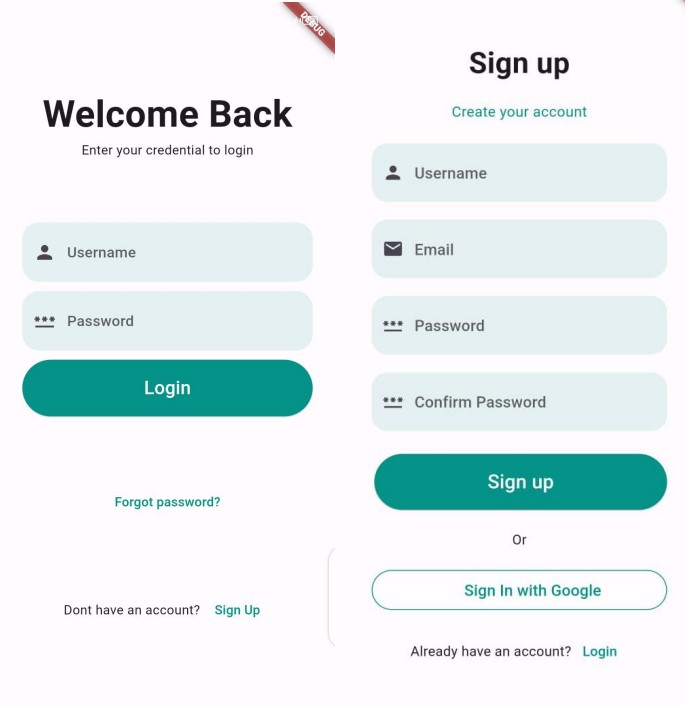
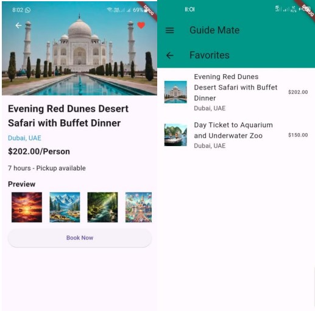
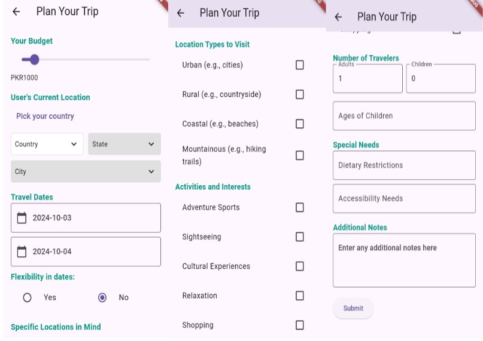
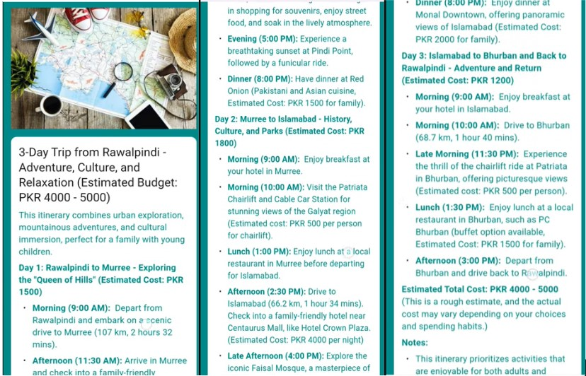
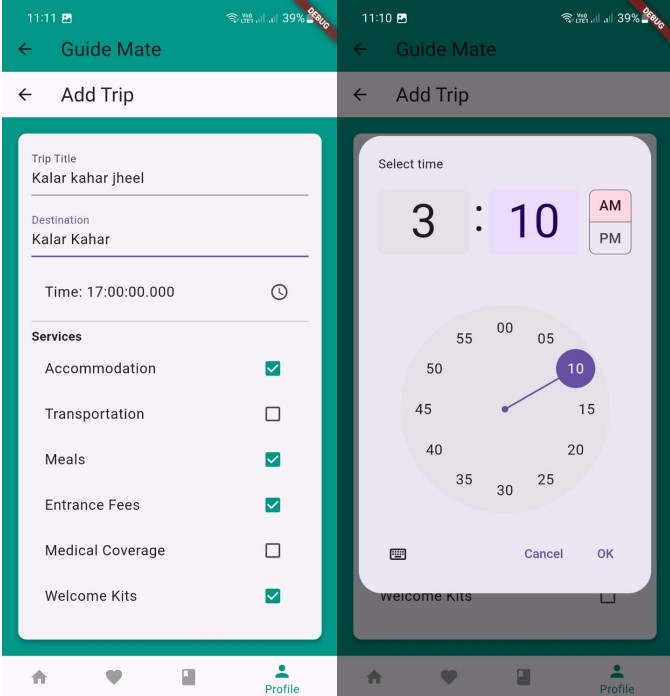

# Guide Mate

**Your smart travel companion for seamless trip planning, 3D virtual tours, and real-time AI guidance.**
- [Documentation](https://drive.google.com/file/d/12rK0w3wSFz6KEGoWCwLSeyO6rKHnnAB9/view?usp=sharing)
- [Business Pitch](https://drive.google.com/file/d/11LCD6WcZBgLsm4OA6NrFrMFZ0gFPJE84/view?usp=sharing)

## Table of Contents
- [Introduction](#introduction)
- [Features](#features)
- [Technologies](#technologies)
- [Usage](#usage)
- [Contact](#contact)

---

## Introduction

Guide Mate is an innovative travel app designed to simplify trip planning by embedding accurate data from Google maps api utilizing function calling ability of Gemini, enhance travel experiences, and provide real-time, AI-powered guidance. With Guide Mate, users can plan trips based on personal preferences, explore destinations via immersive 3D virtual tours, and receive up-to-date weather-driven advice on what to pack, wear, and expect at their chosen locations.

## Features

- **Real-Time Trip Planning**: Plan trips based on your budget, time, and preferences, with realistic itineraries powered by Gemini AI and Google Maps.
- **3D Virtual Tours**: Explore destinations virtually with AI-guided voiceovers and real-time weather updates.
- **Search and Discover**: Find travel guides and agencies by location, language, and ratings.
- **Customizable User Profiles**: Manage preferences, upload profiles, and keep track of bookings.
- **Travel Agency Tools**: Create, promote, and manage trips, including adding descriptions, images, and promotional content. Travel agencies can also add new trips with detailed itineraries, pricing, and dates.
- **Tour Guide Timeline Management**: Guides can manage their availability timeline and set specific times when they are available for bookings.
- **Real-Time Weather Guidance**: Get AI-generated tips based on current weather and local customs.

## Technologies

- **Flutter**: For front-end mobile app development.
- **Firebase**: For backend services including storage and authentication.
- **Google Maps API**: For real-time distance and time calculations in trip planning.
- **Weather API**: For real-time weather updates in 3D virtual tours.
- **Gemini AI**: For generating customized trip itineraries and providing contextual guidance.

## Usage

1. **Sign up as a traveler, guide, or travel agency**
   
   After launching the app, you’ll be prompted to sign up. You can create an account by providing basic information such as name, email, and password. Travelers, guides, and agencies have their own registration paths. 

   

2. **explore available trips, guides, and agencies and favourites**

   Once logged in, you can check trips and guides based on your location, preferred activities, or travel dates.

   

    You can also bookmark trip for later.
   

3. **Plan your trip with AI-generated itineraries and realistic travel times**

   Use the trip planner to enter your preferences (like destinations, budget, and time). 

   

   The Gemini AI, connected to Google Maps, generates a realistic itinerary based on travel times and distances.
   

4. **Take a 3D virtual tour of your destination with real-time weather updates and personalized advice**

   Explore locations with stunning 3D virtual tours and get real-time advice from the AI on what to wear or pack based on current weather conditions of place.
   
   https://github.com/user-attachments/assets/7d6aaef1-0565-43b4-b8a0-d5042f98b1cc
   
6. **Manage Your Profile**

   Whether you're a traveler, guide, or agency, you can manage your profile by updating preferences, uploading images, and managing bookings.
   

7. **Guides can manage their availability through the timeline feature and update booking status**

   Guides can update their availability and accept or reject bookings, making it easy to manage their schedule.
    

8. **Travel agencies can create new trips, adding details like destinations, itineraries, dates, and promotional content**

   Travel agencies can upload and manage their trips, complete with detailed itineraries, pricing, and stunning images to promote the trips.

   

## Contact

For inquiries, please reach out to us at:

- **Email**: [aymennoor552@gmail.com](mailto:aymennoor552@gmail.com)
- **GitHub**: [github.com/MN-Noor/AI-GuideMate](https://github.com/MN-Noor/AI-GuideMate)
